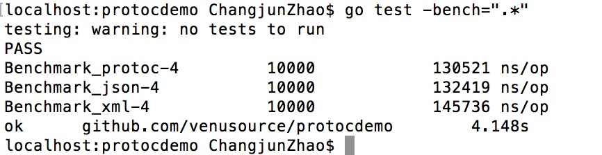
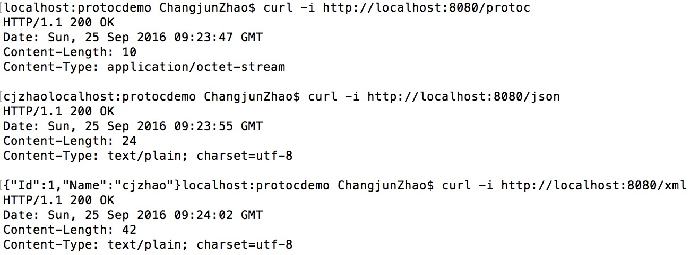

## protobuf 性能测试

对protobuf、json、xml进行性能对比测试

### 使用方法

#### 启动服务器
```
go run server.go
```

#### 执行如下命令进行测试

```
go test -bench=".*"
```
测试结果如下所示：



数据传输大小使用curl -i进行测试：



#### 结论

protobuf的整体性能最优，xml性能最差。

protobuf的数据传输大小最小，xml最大。
